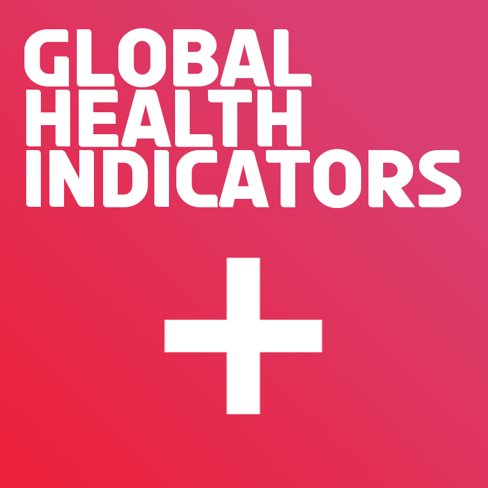
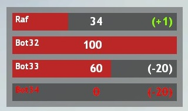

# Global Healh Indicators (GHI)

    

## What is it?

Global Health Indicators is a simple Gmod addon to display the health of everyone on the server on the HUD. This will show the health and health change of everyone on the server in real-time and can be used to test the damage of your weapons.

    

**NOTE: This addon is very rough around the edges, meaning that it's basically a minimum viable product and should really only be used to test your weapons, traps, etc. on your TEST servers.** 

## Convars
**Client:**
- **ghi_enabled 0/1** - Toggles the panel on the HUD.
- **ghi_draw_health_text 0/1** - Toggles the health text. 
- **ghi_draw_last_damage 0/1** - Toggles damage text.

**Server:**
- **ghi_sv_enabled 0/1** - Toggles the health monitoring on the server-side. 
- **ghi_sv_console_log 0/1** - Toggles damage loggin in the server console.

## Links
[Steam Workshop](https://steamcommunity.com/sharedfiles/filedetails/?id=2921839782)

## Known issues
- [TTT] If there's only one person on the server as a spectator, the background would still be drawn.
- Sometimes on new player connection, the HUD doesn't update properly.

## Licence

Feel free to use and modify the code to your own liking, following the guidelines of the MIT licence.
